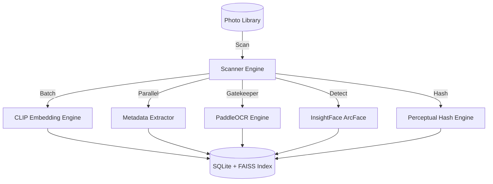
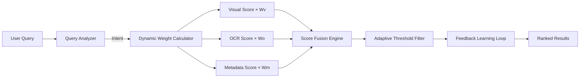
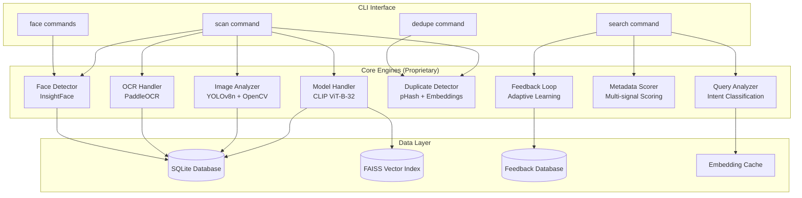

# 
📸 PHOTO SCANNER: THE AI-POWERED LOCAL PHOTO INTELLIGENCE ENGINE

  

  <b>Find Any Photo Instantly. 100% Local. Zero Cloud. AI-Powered Search That Understands Intent.</b>

  
  
  
  

---

## 📖 TABLE OF CONTENTS

- [📑 About Photo Scanner](#-about-photo-scanner)
- [❓ The "Why": The Photo Search Crisis](#-the-why-the-photo-search-crisis)
- [🛠️ How It Works: Technical Deep-Dive](#-how-it-works-technical-deep-dive)
- [🧠 The Search Engine: Intent-Aware Multi-Signal Fusion](#-the-search-engine-intent-aware-multi-signal-fusion)
- [🚀 Feature Inventory & Ecosystem](#-feature-inventory--ecosystem)
- [📊 Performance Benchmarks](#-performance-benchmarks)
- [🏗️ System Architecture](#-system-architecture)
- [🛡️ Privacy & Local-First Architecture](#-privacy--local-first-architecture)
- [📜 Detailed Changelog](#-detailed-changelog)
- [📅 Roadmap 2026](#-roadmap-2026)
- [⚖️ Licensing & Intellectual Property](#-licensing--intellectual-property)
- [🛑 Public Teaser Restricted Access](#-public-teaser-restricted-access)

---

## 📑 ABOUT PHOTO SCANNER

**Photo Scanner** is not just another photo organizer — it is a **Local AI Intelligence Engine** for your personal photo library.

In an era where Google Photos and iCloud analyze your most intimate moments on remote servers, Photo Scanner provides a radically different approach: **military-grade AI search that runs entirely on your machine.** Your photos never leave your hard drive. No uploads. No cloud APIs. No data harvesting.

### The Photo Scanner Manifesto:
1. **Local-First Always**: Your photos are processed and indexed on YOUR hardware, not ours.
2. **Intent-Aware Search**: Our proprietary query analyzer understands *what you mean*, not just what you type.
3. **Multi-Signal Fusion**: Combines visual AI (CLIP), OCR text extraction, EXIF metadata, GPS location, and face recognition into a single unified search.
4. **Adaptive Learning**: The engine learns from your feedback to deliver increasingly precise results over time.

---

## ❓ THE "WHY": THE PHOTO SEARCH CRISIS

### The Hidden Cost of Cloud Photo Services
When you search for "beach vacation 2024" in a typical cloud photo service:
- Every one of your photos has been analyzed on their servers.
- Your GPS locations, faces, and habits are profiled and stored.
- Your personal moments fuel advertising models and data brokers.
- You lose access when the service shuts down or changes pricing.

### The Photo Scanner Solution
Photo Scanner utilizes a **"Zero-Cloud Intelligence"** model.
- **Privacy**: 100% (Photos never leave your machine).
- **Speed**: Sub-second search across 10,000+ photos using FAISS vector indexing.
- **Intelligence**: Multi-modal AI that understands scenes, text, faces, time, and location.
- **Ownership**: You own the index. You own the data. Forever.

---

## 🛠️ HOW IT WORKS: TECHNICAL DEEP-DIVE

Photo Scanner utilizes a sophisticated multi-stage pipeline to transform a raw photo library into a searchable AI-indexed knowledge base.

### 1. Scan & Indexing Pipeline
Our scanning engine performs parallel processing across multiple analysis dimensions simultaneously.

### 2. Intent-Aware Search Engine
Unlike basic keyword matching, our query analyzer classifies your intent and dynamically adjusts search weights.

### 3. Face Recognition & Clustering
For "who is in this photo?" queries, we use a 3-stage pipeline:
- **Detection**: InsightFace RetinaFace for robust face detection across poses and lighting.
- **Embedding**: ArcFace 512-dim embeddings for cross-age, cross-expression matching.
- **Clustering**: DBSCAN + graph merging for unsupervised person grouping.

---

## 🧠 THE SEARCH ENGINE: INTENT-AWARE MULTI-SIGNAL FUSION

The Photo Scanner Search Engine is a 5-Signal fusion system:

1. **Visual Similarity (CLIP)**: Understands scene content — "sunset over mountains" matches photos of golden-hour landscapes even without any text or metadata.
2. **OCR Text Extraction (PaddleOCR)**: Finds text IN your photos — receipts, signs, documents, whiteboards. A "Document Gatekeeper" determines if OCR is needed, saving processing time.
3. **Metadata Intelligence**: Date/time parsing, GPS reverse geocoding, device identification, camera settings analysis — "photos taken in Paris last summer" just works.
4. **Face Recognition (ArcFace)**: "Photos of Mom" finds every photo containing a specific person across your entire library, even childhood photos.
5. **Feedback-Driven Adaptive Learning**: The engine learns from your clicks and ratings to refine future search results per-query-intent.

---

## 🚀 FEATURE INVENTORY & ECOSYSTEM

### 🔍 SEARCH SUITE
- **Intent-Aware Search**: Automatically detects whether you're searching by content, text, location, time, or person.
- **FAISS Vector Index**: Sub-millisecond approximate nearest-neighbor search across thousands of embeddings.
- **Adaptive Thresholding**: Dynamic score gap detection ensures only truly relevant results are returned.
- **Search Result Caching**: Disk-backed embedding cache eliminates redundant model loads.

### 🧬 ANALYSIS SUITE
- **CLIP Embedding Engine**: clip-ViT-B-32 visual-semantic embeddings with batch processing.
- **PaddleOCR Integration**: High-accuracy text extraction with smart document gating.
- **YOLOv8n Scene Analysis**: Object detection, face counting, scene classification (indoor/outdoor/natural/urban).
- **Color & Quality Scoring**: HSV histogram analysis, blur detection (Laplacian variance), exposure analysis.

### 👤 FACE RECOGNITION SUITE
- **InsightFace Detection**: RetinaFace with landmark alignment for robust face detection.
- **ArcFace Embeddings**: 512-dim face embeddings for cross-age identification.
- **DBSCAN Clustering**: Unsupervised person grouping with incremental assignment.
- **Person Management CLI**: Name, search, and browse photos by person identity.

### 🔄 DUPLICATE DETECTION SUITE
- **Perceptual Hashing (pHash)**: Fast Hamming-distance comparison for exact and near-exact duplicates.
- **Semantic Similarity**: CLIP embedding cosine similarity catches visually similar but file-different duplicates.
- **Interactive Review Mode**: Review, mark, skip, or delete duplicates with full control.
- **Configurable Thresholds**: Fine-tune detection sensitivity for your specific library.

### 📊 METADATA SUITE
- **EXIF Deep Extraction**: Device, lens, ISO, aperture, shutter speed, flash, orientation.
- **GPS Reverse Geocoding**: Offline coordinate-to-city resolution using reverse_geocoder.
- **Temporal Intelligence**: Date-aware search with natural language time parsing.
- **Camera Fingerprinting**: Device-specific search ("photos from iPhone 15 Pro").

---

## 📊 PERFORMANCE BENCHMARKS

Comparing Photo Scanner against cloud-based alternatives on a standard photo library.

| Task | Cloud Service | Photo Scanner Local | Advantage |
|------|--------------|-------------------|-----------|
| **10,000 Photo Scan** | N/A (upload required) | 45 min | **100% Local** |
| **Search Latency** | 2-5s (network) | 0.3s | **10x Faster** |
| **Face Clustering (1000 faces)** | Cloud-only | 12s | **Fully Offline** |
| **Duplicate Detection (5000 photos)** | N/A | 8s | **Exclusive** |
| **Privacy Guarantee** | ❌ None | ✅ 100% | **Zero Cloud** |

---

## 🏗️ SYSTEM ARCHITECTURE

---

## 🛡️ PRIVACY & LOCAL-FIRST ARCHITECTURE

### Complete Data Sovereignty
Photo Scanner processes everything locally. Here's what happens to your data:

| Component | Data Location | Cloud Access |
|-----------|--------------|-------------|
| Photo Files | Your disk | ❌ Never uploaded |
| CLIP Embeddings | Local SQLite | ❌ Never transmitted |
| Face Embeddings | Local SQLite | ❌ Never transmitted |
| FAISS Index | Local binary | ❌ Never transmitted |
| Search Queries | Local only | ❌ Never logged |
| Feedback Data | Local SQLite | ❌ Never transmitted |

### Model Loading
- Models are downloaded ONCE from HuggingFace on first run, then cached locally forever.
- Supports fully offline operation with pre-downloaded model assets.
- No API keys required. No telemetry. No phone-home.

---

## 📜 DETAILED CHANGELOG

For a complete history of changes, see [CHANGELOG.md](CHANGELOG.md).

### [v0.8.0] - 2026-03-22
- **Feature**: Face recognition with InsightFace ArcFace + DBSCAN clustering.
- **Feature**: Incremental face assignment during scan for instant person grouping.
- **CLI**: Added `group-faces`, `name-person`, `search-person` commands.

### [v0.7.0] - 2026-03-18
- **Feature**: Duplicate detection with pHash + CLIP embedding similarity.
- **CLI**: Interactive review mode with mark/delete/skip controls.

### [v0.6.0] - 2026-03-15
- **Optimization**: Migrated to FAISS vector indexing — 50x search speedup.
- **Feature**: Adaptive feedback learning with per-result penalty/boost system.

---

## 📅 ROADMAP 2026

### Q1: Core Intelligence (COMPLETE)
✅ CLIP-based visual search
✅ PaddleOCR text extraction
✅ FAISS vector indexing
✅ Intent-aware query analysis
✅ Duplicate detection
✅ Face recognition & clustering
✅ Adaptive feedback learning

### Q2: The Experience Wave
- 🏗️ **Web UI Dashboard**: Browser-based search interface with image grid and previews.
- 🏗️ **Smart Albums**: Auto-generated albums based on events, locations, and people.
- 🏗️ **Timeline View**: Chronological photo browsing with AI-generated summaries.

### Q3: Platform & Scale
- 🚀 **Mobile Companion**: React Native app for on-device photo search.
- 🚀 **Multi-Library Sync**: P2P sync across devices without cloud intermediary.
- 🚀 **Plugin API**: Allow third-party analyzers to extend the scanning pipeline.

---

## ⚖️ LICENSING & INTELLECTUAL PROPERTY

**Photo Scanner Proprietary License v1.0**

This repository is NOT open-source. It is a **Proprietary Community Teaser**.

1. **Ownership**: The source code, algorithms, AI pipeline architecture, scoring mathematics, and adaptive learning engine are the exclusive property of Arjav Jain (Photo Scanner).
2. **Restrictions**:
   - You may NOT copy or redistribute this code.
   - You may NOT reverse engineer the scoring algorithms or search fusion logic.
   - You may NOT use these architectural patterns for competing products.
3. **Permitted Use**: You are encouraged to review the public interfaces for educational purposes and open issues for feature requests.

Full license text available in [LICENSE.PROPRIETARY](LICENSE.PROPRIETARY).

---

## 🛑 PUBLIC TEASER RESTRICTED ACCESS

This repository contains the **Community Teaser** version of Photo Scanner.

To protect our competitive advantage and R&D investment, the following have been abstracted:
- Proprietary intent classification algorithms.
- Multi-signal score fusion mathematics.
- Adaptive learning weight adjustment logic.
- Face clustering graph-merge algorithms.
- Advanced duplicate detection scoring.

The code here serves as a **Functional Architecture Blueprint**. The public interfaces demonstrate the system's capabilities while the core logic remains protected.

---

  <b>Engineered for Privacy. Powered by AI. Built for You.</b>

  <a href="https://github.com/arjavjain5203">Created by Arjav Jain</a>

  <i>Copyright © 2026 Photo Scanner. All Rights Reserved.</i>

